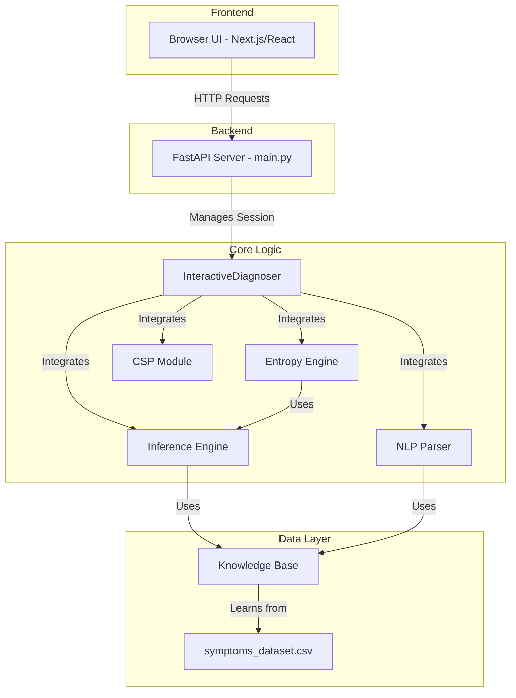

<div align="center">

```
██╗   ██╗ ██████╗ ███████╗██████╗ 
██║   ██║██╔════╝ ██╔════╝╚════██╗
██║   ██║██║  ███╗███████╗ █████╔╝
╚██╗ ██╔╝██║   ██║╚════██║██╔═══╝ 
 ╚████╔╝ ╚██████╔╝███████║███████╗
  ╚═══╝   ╚═════╝ ╚══════╝╚══════╝
```

# VGS2: AI-Powered Interactive Diagnoser

**An intelligent diagnostic system that uses Bayesian inference and information theory to conduct a conversation and identify potential diseases from symptoms.**

</div>

[](https://www.python.org/)
[](https://fastapi.tiangolo.com/)
[](https://nextjs.org/)
[](https://spacy.io/)

---

## ✨ Overview

Welcome to VGS-2, a sophisticated medical diagnostic assistant. This project isn't just another symptom checker; it's a dynamic conversational AI that intelligently guides the user through a diagnostic process. It uses a probabilistic model to reason about symptoms and an entropy-based engine to decide the most informative question to ask next, ensuring the diagnosis is as quick and accurate as possible.

The entire diagnostic logic is wrapped in a clean **FastAPI** backend, making it ready for integration with any modern web or mobile frontend.

## 🚀 Key Features

- **🧠 Bayesian Inference Engine**: At its core, the system uses Bayes' theorem to update its beliefs about potential diseases as new symptom information is provided.
- **🔍 Intelligent Questioning**: Powered by an **Entropy Engine**, the system doesn't ask random questions. It calculates the "Information Gain" for each potential question and picks the one that will reduce the most uncertainty.
- **🗣️ Natural Language Understanding**: Users can describe their symptoms in plain English, and our **spaCy-powered NLP Parser** will understand and structure the information.
- **🎤 Voice-to-Text Input**: Integrated **Google Cloud Speech-to-Text API** allows users to describe symptoms using voice commands, making the experience more accessible.
- **💡 AI-Powered Suggestions**: Real-time symptom suggestions using **Gemini LLM** that intelligently matches user input to known medical symptoms, reducing spelling errors and improving accuracy.
- **🧩 Constraint-Based Logic**: A **Constraint Satisfaction Problem (CSP)** module ensures that the system considers logical rules, such as dependencies or mutual exclusions between symptoms.
- **📄 Professional PDF Reports**: Generate comprehensive diagnostic reports with official stamps, formatted tables, and detailed session summaries for patient records.
- **🌐 API-Ready**: A robust **FastAPI** server exposes the diagnostic logic through a clean, well-documented API, ready for any UI to consume.
- **🧪 Simulator Included**: A built-in simulation module allows for testing the diagnostic engine's accuracy and efficiency against the entire dataset.
- **📊 Interactive Visualizations**: Explore disease relationships, symptom co-occurrence, and probability heatmaps through beautiful, interactive graphs.

## 🏗️ System Architecture

The project is designed with a modular and decoupled architecture, making it easy to maintain and extend.



## 🏁 Getting Started

Follow these steps to get the project up and running on your local machine.

### 1. Prerequisites

- **Conda**: You must have `conda` installed to manage the environment. You can get it by installing [Miniconda](https://docs.conda.io/en/latest/miniconda.html) or [Anaconda](https://www.anaconda.com/products/distribution).

### 2. Clone the Repository

```bash
git clone https://github.com/jaisw07/vgs2.git
cd vgs2
```

### 3. Set Up Environment Variables

Create a `.env` file in the root directory and add your API keys:

```bash
GEMINI_API_KEY=your_gemini_api_key_here
```

For the frontend, create a `.env.local` file in the `frontend/` directory:

```bash
NEXT_PUBLIC_GOOGLE_API_KEY=your_google_cloud_api_key_here
```

### 4. Set Up the Conda Environment

Create the conda environment from the `environment.yml` file. This will install all the necessary Python dependencies.

```bash
conda env create -f environment.yml
```

Once the installation is complete, activate the environment:

```bash
conda activate vgs2-env
```

### 5. Install Additional Python Dependencies

```bash
pip install google-generativeai
```

### 6. Download the NLP Model

The NLP parser requires a `spaCy` language model. Download it with this command:

```bash
python -m spacy download en_core_web_sm
```

### 7. Generate Symptoms JSON (Optional but Recommended)

Generate the symptoms JSON file for the frontend suggestion engine:

```bash
python generate_symptoms_json.py
```

### 8. Set Up the Frontend

Navigate to the frontend directory and install dependencies:

```bash
cd frontend
npm install
cd ..
```

### 9. Run the Backend Server

Now, you can start the FastAPI server.

```bash
uvicorn main:app --reload
```

The server will be running at `http://127.0.0.1:8000`.

### 10. Run the Frontend Development Server

In a new terminal, navigate to the frontend directory and start the Next.js development server:

```bash
cd frontend
npm run dev
```

The frontend will be running at `http://localhost:3000`.

### 11. Explore the API

You can now access the interactive API documentation (Swagger UI) in your browser at:
**[http://127.0.0.1:8000/docs](http://127.0.0.1:8000/docs)**

From here, you can test the API endpoints directly.

## 🔌 API Usage

The API is designed to be used in a conversational manner. For full details on the workflow and endpoint models, please refer to the comprehensive documentation file:

**[➡️ API_DOCUMENTATION.md](API_DOCUMENTATION.md)**

### Key Endpoints

- **POST /start** - Initialize a new diagnostic session
- **POST /describe** - Submit free-text symptom description (parsed by NLP)
- **POST /answer** - Answer a yes/no symptom question
- **POST /suggest** - Get AI-powered symptom suggestions (used by frontend)

## 🎨 Frontend Features

The Next.js frontend provides a modern, responsive user interface with:

- **🎤 Voice Input**: Speak your symptoms using Google Cloud Speech-to-Text
- **💬 Smart Suggestions**: AI-powered autocomplete that suggests symptoms as you type
- **📊 Real-time Visualization**: Live probability updates as you answer questions
- **📱 Responsive Design**: Works seamlessly on desktop, tablet, and mobile
- **📄 PDF Reports**: Generate professional diagnostic reports with one click
- **📈 Data Visualizations**: Explore disease similarities and symptom relationships
- **🎯 Intuitive Navigation**: Clean, user-friendly interface with smooth transitions

## 📂 Project Structure

```
vgs2/
├── API_DOCUMENTATION.md      # Detailed API documentation for UI developers/AI.
├── main.py                   # FastAPI application entry point.
├── environment.yml           # Conda environment definition.
├── generate_symptoms_json.py # Script to generate symptoms JSON for frontend.
├── .env                      # Environment variables (API keys) - not tracked
├── .gitignore                # Files and folders to be ignored by Git.
├── README.md                 # This file.
├── data/
│   └── symptoms_dataset.csv  # The core dataset of symptoms and diseases.
├── frontend/                 # Next.js/React frontend application
│   ├── package.json          # Frontend dependencies
│   ├── .env.local            # Frontend environment variables - not tracked
│   ├── src/
│   │   ├── app/              # Next.js app router pages
│   │   │   ├── page.tsx      # Main application page
│   │   │   └── api/          # API route handlers
│   │   ├── components/       # React components
│   │   │   ├── NavBar.tsx
│   │   │   └── diagnostic/   # Diagnostic-related components
│   │   │       ├── FreeTextInput.tsx        # Text/voice input with AI suggestions
│   │   │       ├── CurrentQuestion.tsx      # Question display
│   │   │       ├── DiseaseProbabilities.tsx # Real-time probability chart
│   │   │       ├── ReportGenerator.tsx      # PDF report generation
│   │   │       └── ...
│   │   ├── context/          # React context and data files
│   │   │   ├── symptoms.json # Generated list of all symptoms
│   │   │   └── DataContext.tsx
│   │   ├── pages/            # Page components
│   │   │   ├── HomePage.tsx
│   │   │   ├── AboutPage.tsx
│   │   │   ├── ResultsPage.tsx  # Dataset visualizations
│   │   │   └── ...
│   │   └── types.ts          # TypeScript type definitions
│   └── public/               # Static assets (images, visualizations)
├── src/                      # Core Python source code for the diagnostic engine.
│   ├── knowledge_base.py     # Loads data and computes probabilities.
│   ├── inference_engine.py   # Performs Bayesian inference.
│   ├── entropy_engine.py     # Selects the best questions to ask.
│   ├── nlp_parser.py         # Handles free-text symptom parsing.
│   ├── csp_module.py         # Manages logical constraints.
│   ├── interactive_diagnoser.py # Main diagnostic session manager.
│   └── ...
├── config/                   # Configuration files
│   ├── constraints.json      # Logical constraint rules
│   └── fuzzy_symptom_map.json
├── results/                  # (Ignored by Git) Output from simulations and logs.
└── visualizations/           # (Ignored by Git) Generated graphs and heatmaps.
```

## 💡 Future Enhancements

This project has a solid foundation, but there are many ways it could be extended:

- **Persistent Session Storage**: Use Redis or a database to store session data, allowing users to resume a diagnosis.
- **User Accounts**: Implement user authentication to save diagnostic history and past reports.
- **Advanced NLP**: Use more advanced NLP techniques to handle more complex sentence structures and medical terminologies.
- **Multi-language Support**: Extend the system to support multiple languages for global accessibility.
- **Model Retraining**: Create a pipeline to periodically retrain the knowledge base with new medical data.
- **Integration with EHR Systems**: Connect with Electronic Health Records for comprehensive patient data management.
- **Mobile Apps**: Build native iOS and Android applications using React Native.
- **Telemedicine Integration**: Connect patients directly with healthcare providers based on diagnosis results.

## 🛠️ Technologies Used

### Backend
- **Python 3.11** - Core programming language
- **FastAPI** - High-performance web framework
- **spaCy** - Natural language processing
- **Google Gemini AI** - Large language model for intelligent suggestions
- **Pandas & NumPy** - Data manipulation and analysis
- **Scikit-learn** - Machine learning utilities

### Frontend
- **Next.js 16** - React framework with App Router
- **React 19** - UI library
- **TypeScript** - Type-safe JavaScript
- **Tailwind CSS** - Utility-first CSS framework
- **Lucide React** - Beautiful icon library
- **jsPDF** - PDF generation
- **Google Cloud Speech-to-Text** - Voice recognition

### Data Science & Visualization
- **Matplotlib & Seaborn** - Static visualizations
- **NetworkX** - Graph analysis and visualization
- **Python-Louvain** - Community detection algorithms

## 📝 License

This project is developed for educational and research purposes.

## 👥 Contributors
- **Shrey Jaiswal** - Algorithm Development and Diagnosis Model Building
- **Gaurav Ghosh** - Backend Development and API Routing
- **Vanshita Mehta** - Frontend Development

## 🙏 Acknowledgments

- Medical dataset sourced from public health databases
- spaCy for excellent NLP capabilities
- FastAPI community for comprehensive documentation
- Next.js team for the amazing React framework

---
<div align="center">
Made with ❤️ and lots of code.
</div>
